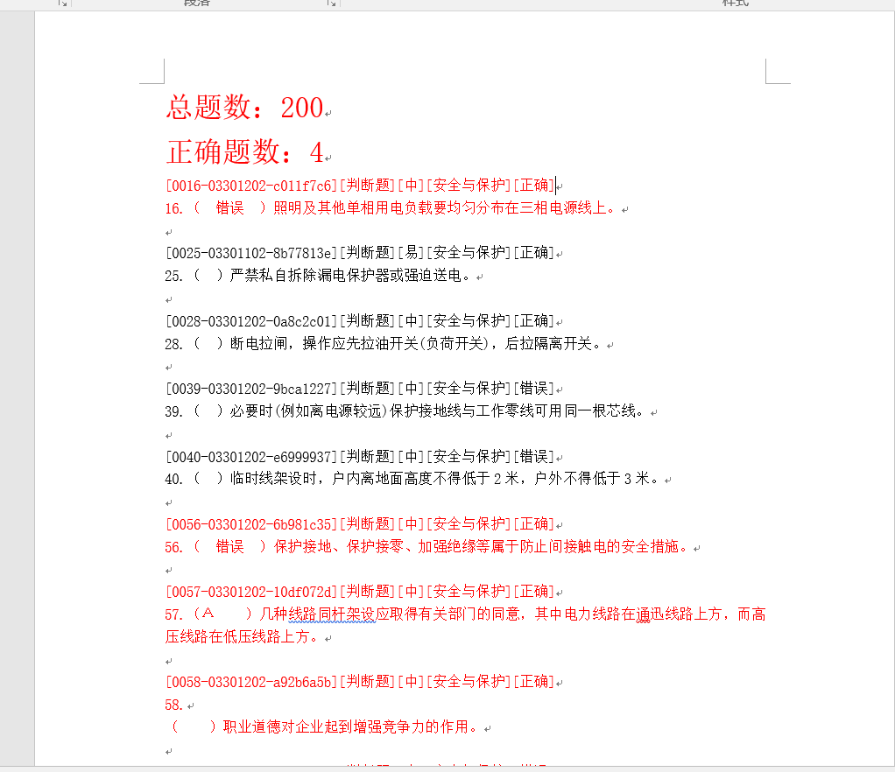

# DocReader
C++ automates selection of examination questions randomly from doc file by Microsoft Office Word.  

# Environment
My environment is visual studio 2017 and Word 2016 and MFC is necessary in this project.  

# Function
1. It can select a certain number of questions from question bank.  

2. And after you solve the questions, the next program will autumatically correct your answer by create a new doc file include reference solutions.

3. If your solution is wrong, the question will be marked by red color and your wrong answer will also be given in the new doc file.

# Presentation  

